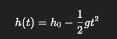

# Programming in Science - Lab 2

This template repository is the starter project for Programming in Science Lab 2. Written in Python.

### Question(s)

1. A ball is dropped from a height  h_0  (in meters), and after a given time  t  (in seconds), the height  h(t)  of the ball is given by the formula:



Where:
- h(t)  is the height of the ball at time  t  (in meters).  
- h_0  is the initial height from which the ball is dropped (in meters).  
- g  is the acceleration due to gravity, which is approximately  9.8 \, m/s^2 .  
- t  is the time elapsed since the ball was dropped (in seconds).  

Tasks:  

1.	Define an algorithm that describes the steps to calculate the height of the ball at time  t  using the given formula.  
2.	Write a Python function that calculates the height of the ball at time  t  after being dropped from an initial height  h_0 .  
3.	Perform arithmetic operations to calculate the height of the ball at a given time.  
4.	Test your function by calculating the height of a ball dropped from a height of 50 meters at 3 different time intervals (e.g., at 1 second, 2 seconds, and 3 seconds).  
5.	Apply basic debugging techniques to check that your code works for different inputs and edge cases (e.g., when  t = 0 ).  

Example Output for calculate_height() Function:  

When running the program for calculate_height(), here’s how the interaction should look:  
```
Enter initial height: 50
Enter time: 1
Height of the ball at time 1 second = 45.1 meters

Enter initial height: 50
Enter time: 2
Height of the ball at time 2 seconds = 30.4 meters

Enter initial height: 50
Enter time: 3
Height of the ball at time 3 seconds = 5.9 meters
```

2. A car travels at a constant speed of 20 meters per second. Calculate the distance the car will travel in a given time t (in seconds). Use the formula:  

  

where:  
- Speed = 20 meters/second  
- Time = given as input in seconds.  

When running the program for calculate_car_distance(), the interaction should look as follows:  

```
Enter time for car (in seconds): 1
The car will travel 20 meters in 1 second.

Enter time for car (in seconds): 2
The car will travel 40 meters in 2 seconds.

Enter time for car (in seconds): 3
The car will travel 60 meters in 3 seconds.
```


## Algorithms, Scientific Formulas, Functions, Testing

**Estimated time:** 75–90 minutes  

## Learning objectives

By the end of this lab you should be able to:

- analyze a scientific problem before coding;
- write a short algorithm;
- translate a formula into Python;
- write reusable functions;
- trace a numerical calculation;
- test boundary cases;
- distinguish mathematical correctness from model validity;
- debug using intermediate values.

## Part 0 — Read the Starter Code and Tests

Open `Lab2.py` and use the examples in this handout for manual testing.

You must implement:

```python
def calculate_height(h0, t):
```

and:

```python
def calculate_car_distance(t):
```

### Before coding, answer

1. What does each function receive?
2. What should each function return?
3. What constant is needed for the falling-ball problem?
4. What examples in the test file give you expected results?
5. What edge case is explicitly tested?

## Part 1 — Falling Ball: Algorithm First

The model is:

```text
h(t) = h0 - 1/2 × g × t²
```

with:

```text
g = 9.8 m/s²
```

### Task 1 — Write the algorithm

Before Python, write 4–6 plain-language steps.

### Task 2 — Trace

For:

```text
h0 = 50
 t = 2
```

show the calculation step by step.

Expected result:

```text
30.4 m
```

### Task 3 — Implement

Write:

```python
def calculate_height(h0, t):
```

It must return the calculated height.

## Part 2 — Constant-Speed Car

A car travels at 20 m/s.

Formula:

```text
d = v × t
```

### Before coding

Identify:

- input;
- constant;
- operation;
- output;
- unit.

Then implement:

```python
def calculate_car_distance(t):
```

The function should return the distance in meters.

## Part 3 — Predict Before Running

Predict:

```python
print(calculate_car_distance(3))
```

Then run the test suite.

## Part 4 — Debugging Challenge

Suppose a student writes:

```python
def calculate_height(h0, t):
    g = 9.8
    return h0 - 0.5 * g * t ** 2

print(calculate_height(50, 2))
```

This is correct for the supplied mathematical model.

Now suppose another student writes:

```python
def calculate_height(h0, t):
    g = 9.8
    return h0 - 0.5 * g * t * 2
```

### Questions

1. What is different?
2. Why does `** 2` matter?
3. What result would the second version give for `50, 2`?
4. How would you detect the error by tracing rather than guessing?

## Part 5 — Scientific Model Challenge

Try:

```python
calculate_height(50, 4)
```

If the answer is negative, should you immediately change the formula?

Discuss:

> Is the Python calculation wrong, or might the physical model have reached its domain limit?

The purpose is to distinguish:

```text
programming correctness
```

from:

```text
scientific model correctness
```

## Part 6 — Extension Challenge

Create a new function in your own file:

```python
def calculate_average_speed(distance, time):
```

Requirements:

- return `distance / time`;
- handle `time == 0` sensibly;
- write at least three tests;
- include a zero-time test.

You may choose whether to return a special value or raise an exception, but document your choice.

## Part 7 — Explain Your Code

Choose one function and answer:

1. What are its inputs?
2. What does it return?
3. What formula does it implement?
4. What assumption does the formula make?
5. What is one edge case?
6. Which test gives you the most confidence and why?

## Responsible AI activity

If you use AI, ask it to review your algorithm or explain a failing test. Do not ask it to replace the entire reasoning process.

Verify any suggestion by running your tests and explain one suggestion you accepted or rejected.

## Submission checklist

- [ ] algorithm for falling ball
- [ ] trace for `h0=50, t=2`
- [ ] `calculate_height()` implemented
- [ ] tests pass
- [ ] `calculate_car_distance()` implemented
- [ ] debugging challenge answered
- [ ] model-limit discussion completed
- [ ] extension function/tests attempted
- [ ] explanation completed

## Suggested grading

| Component | Marks |
|---|---:|
| Problem analysis/algorithm | 15 |
| Falling-ball implementation | 20 |
| Trace and testing | 15 |
| Car-distance implementation | 15 |
| Debugging challenge | 10 |
| Scientific model discussion | 5 |

| Explanation/AI reflection | 10 |
| **Total** | **90** |

